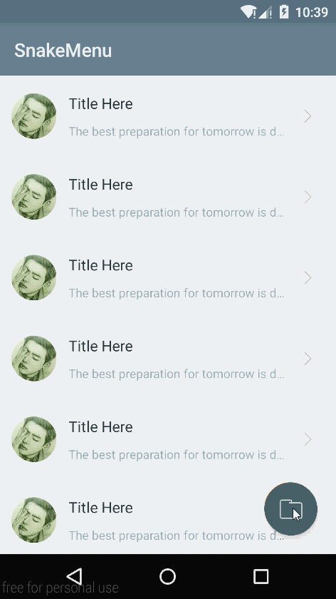
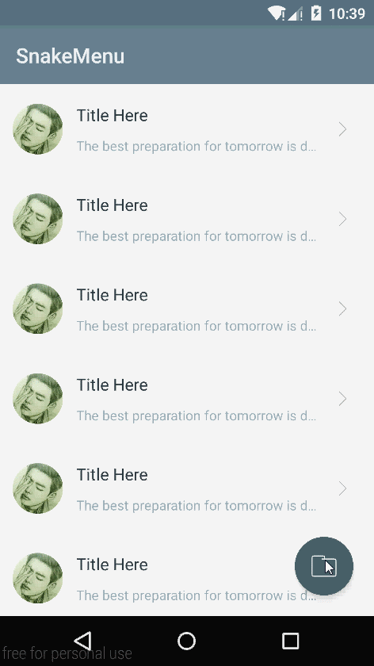

# android-snake-menu
imitate Tumblr's menu, dragging animations look like a snake

####unexpected episode
I found another repository some time ago which implemments the same dragging effects. Besides, its unfold later-menu effects is much more consistent with original Tumblr effects. You can jump to this repository -  [here](https://github.com/tiancaiCC/SpringFloatingActionMenu).

####something irrelated
Several days ago, I installed the tumblr app into my genymotion device, and I was totally shocked by its amazing snake-menu animation which is quite smooth and fluent. Since I cannot clearly describe its visual effects, you’d better install this app and try it yourself.  
Ok, I am always the one who would like to imitate beautiful things. And I was terribly curious about how its animation is implemented. 
####captured images
<td>
	 
	 
	 
</td>
####implement principle
So, at the first sight, do you have any idea about how this animation appears?  
As you know, there are 6 imageviews: P1, P2, P3, P4, P5, P6, and P6 is the top-most imageview which is enabled to be dragged. You can easily figure it out that: P1 follows P2, P2 follows P3, P3 follows P4, P4 follows P5, P5 follows P6.  
First of all, I used ViewDragHelper to make P6 draggable.  
Then, ViewDragHelper.CallBack can tell us some information about P6’s status, such as dragging, released, and P6’s position change and so on. To lighten the parent ViewGroup’s job, I create a ViewTrackController to process P6’s status.  
Afterwards, ViewTrackController is responsible for dealing with all the linkage animations: every time P6’s position changes, causes P5’s target position changes. Every time P5’s position change causes P4’s target position changes. The rest imageviews can be done in the same manner.  
To make the animation pleasing to the eyes, [facebook’s rebound sdk](https://github.com/facebook/rebound) encounters with ViewTrackController. While reviewing the source code, you will find that each imageview has a SpringListener and a fllower-SpringListener. Obviously, P6’s follower is P5, P5’s follower is P4, P4’s follower is P3, etc… P6’s position change will notify P5’s follower-SpringListener, P5’s position change will notify P4’s follower-SpringListener, etc… That’s to say, P6’s position change leads the rest imageviews animate automatically.  
Finally, the animated snake-menu is implemented by this way. 
####contact me
The source code is easy to read. If you have any problems or advice, please leave me a message on the issues, or contact my email: 120809170@qq.com. Besides, welcome for pull requests. 
####demo apk download
[apk download](SnakeMenu.apk) (right in this github repository)
### Version: 1.0

  * Pilot version

## License

    Copyright 2016, xmuSistone

    Licensed under the Apache License, Version 2.0 (the "License");
    you may not use this file except in compliance with the License.
    You may obtain a copy of the License at

       http://www.apache.org/licenses/LICENSE-2.0

    Unless required by applicable law or agreed to in writing, software
    distributed under the License is distributed on an "AS IS" BASIS,
    WITHOUT WARRANTIES OR CONDITIONS OF ANY KIND, either express or implied.
    See the License for the specific language governing permissions and
    limitations under the License.
